# Zendesk Customer Support Implementation for Gochelicious

<p align="center">
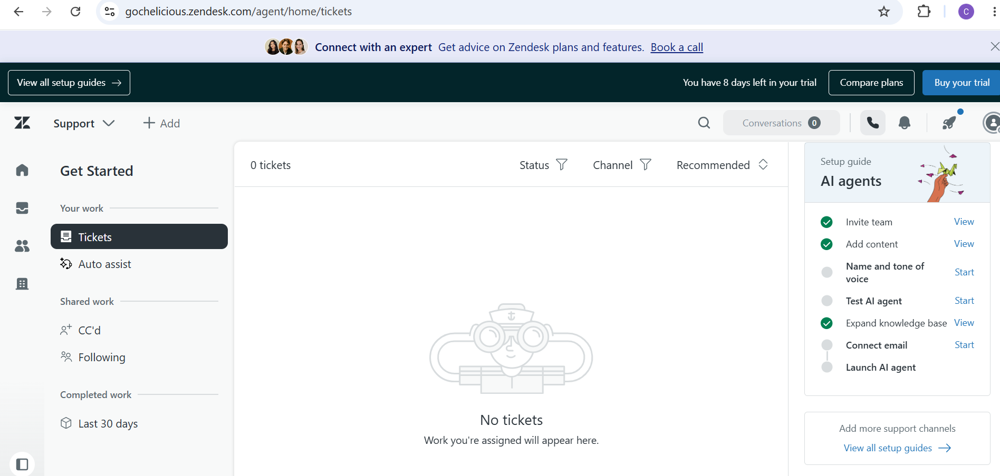
</p>

<p align="center">


</p>

---

# Project Overview

This project showcases the complete implementation of a Zendesk Support environment for **Gochelicious**, a premium food and hospitality brand.

The solution was designed to improve customer support operations through workflow automation, intelligent ticket routing, structured ticket forms, SLA management, knowledge management, macros, and business reporting.

The implementation demonstrates how Zendesk can streamline customer service while improving operational efficiency and customer satisfaction.

---

# Business Objectives

The implementation was designed to:

- Improve customer response times
- Standardize support workflows
- Automate ticket routing
- Reduce manual agent effort
- Create a searchable customer knowledge base
- Implement SLA-driven customer service
- Improve reporting and operational visibility

---

# Solution Overview

The Zendesk environment includes:

- Custom Ticket Forms
- Custom Ticket Fields
- Support Groups
- Team Member Configuration
- Business Triggers
- Ticket Automations
- SLA Policies
- Business Hours
- Knowledge Base
- Macros
- Zendesk Explore Analytics
- Agent Workspace Configuration

---

# Features Implemented

---

## Customer Support Forms & Custom Fields

<table>
<tr>

<td width="50%">

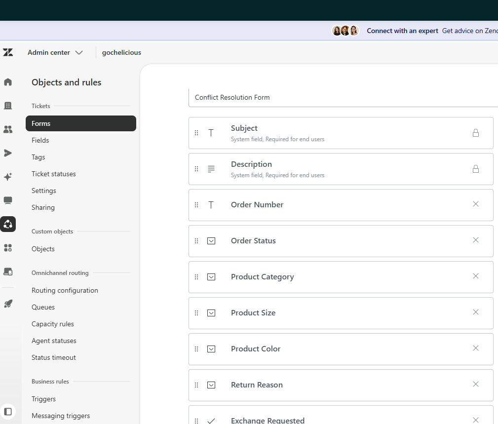

### Customer Support Form

Purpose-built support form that captures structured customer requests, ensuring agents receive complete and consistent information.

</td>

<td width="50%">

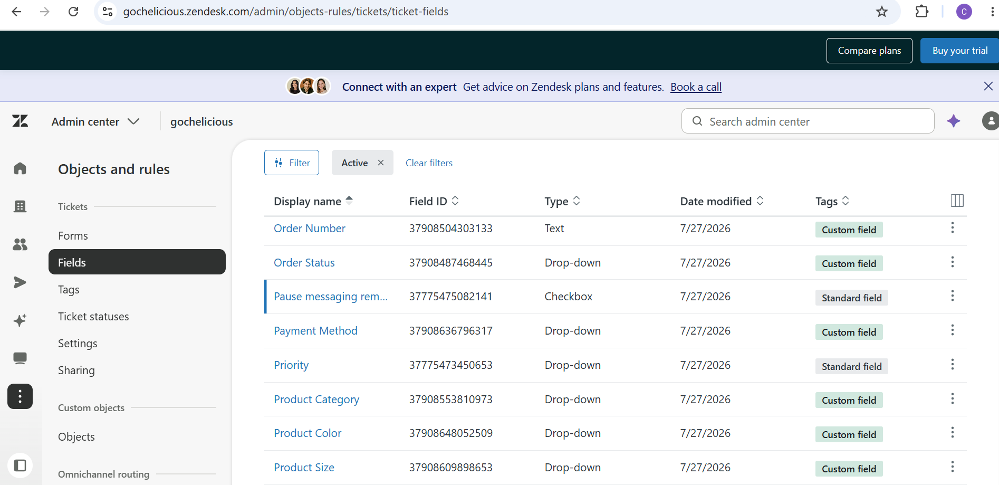

### Custom Ticket Fields

Custom fields were created to capture:

- Order Number
- Order Status
- Payment Method
- Product Category
- Product Size
- Product Color
- Return Reason
- Exchange Request

</td>

</tr>
</table>

---

## Team Structure & Support Groups

<table>
<tr>

<td width="50%">

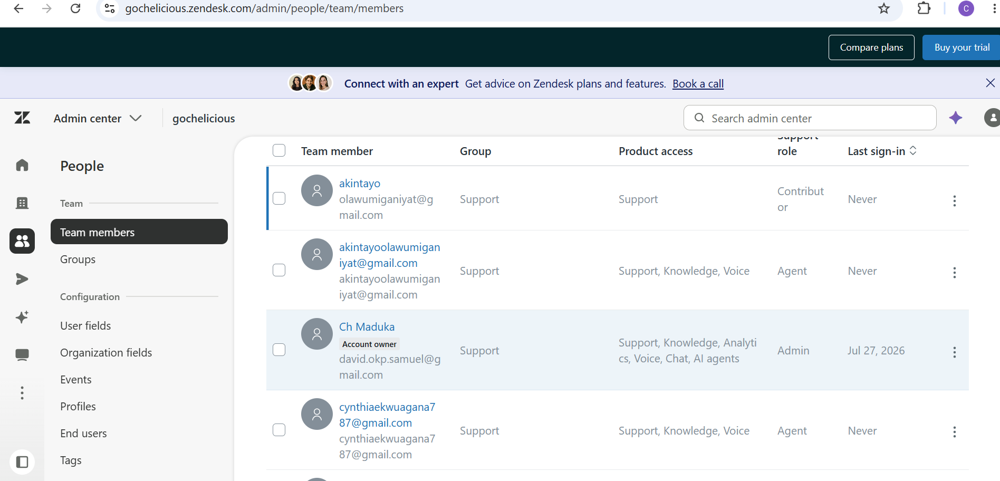

### Team Members

Configured agents with appropriate roles, permissions and product access.

</td>

<td width="50%">

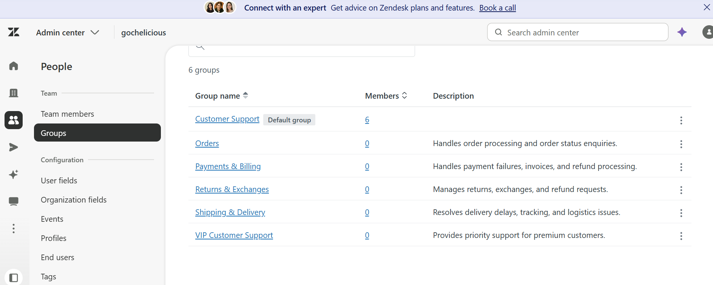

### Support Groups

Created specialized support groups for:

- Customer Support
- Shipping & Delivery
- Returns & Exchanges
- Payments & Billing
- VIP Customer Support
- Orders

</td>

</tr>
</table>

---

## Workflow Automation

<table>
<tr>

<td width="50%">

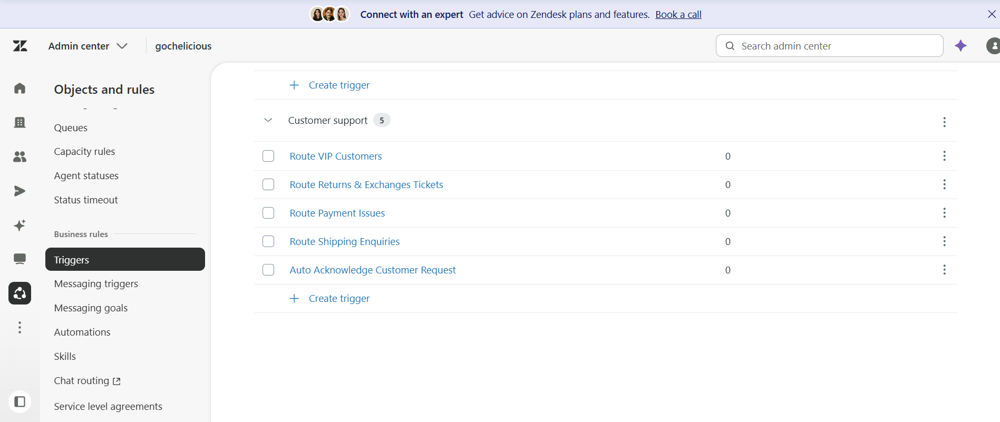

### Business Triggers

Configured automated ticket routing for:

- VIP Customers
- Shipping Enquiries
- Returns & Exchanges
- Payment Issues
- Customer Acknowledgements

</td>

<td width="50%">

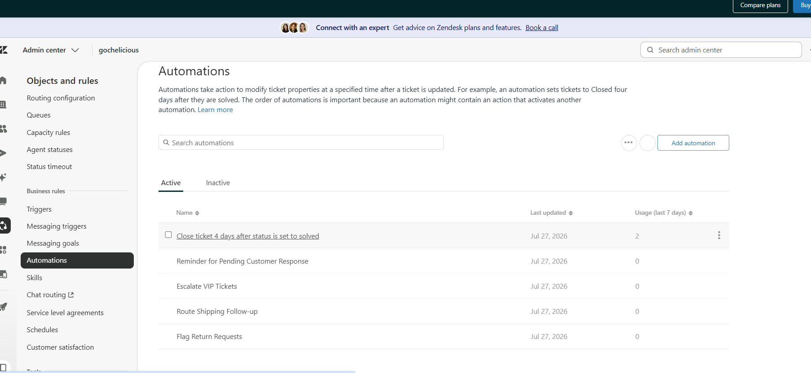

### Ticket Automations

Built automations for:

- Ticket Escalation
- Customer Follow-up
- VIP Escalation
- Return Management
- Auto Ticket Closure

</td>

</tr>
</table>

---

## SLA Management

<table>
<tr>

<td width="50%">

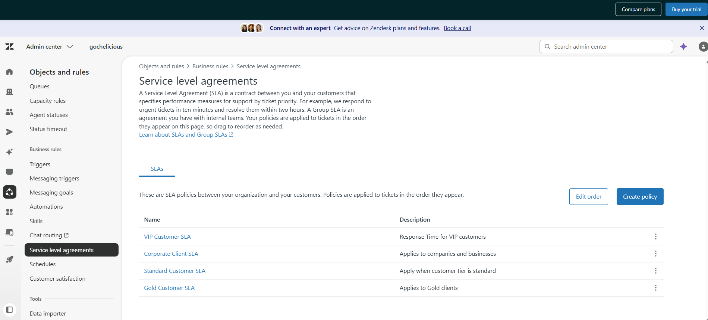

### SLA Policies

Configured response and resolution targets for:

- Standard Customers
- Gold Customers
- Corporate Clients
- VIP Customers

</td>

<td width="50%">

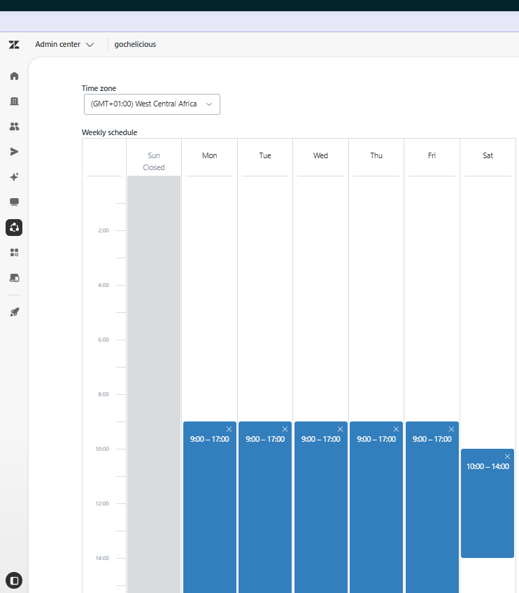

### Business Hours

Configured operating schedules used for SLA calculations and support availability.

</td>

</tr>
</table>

---

## Knowledge Base

<table>
<tr>

<td width="50%">

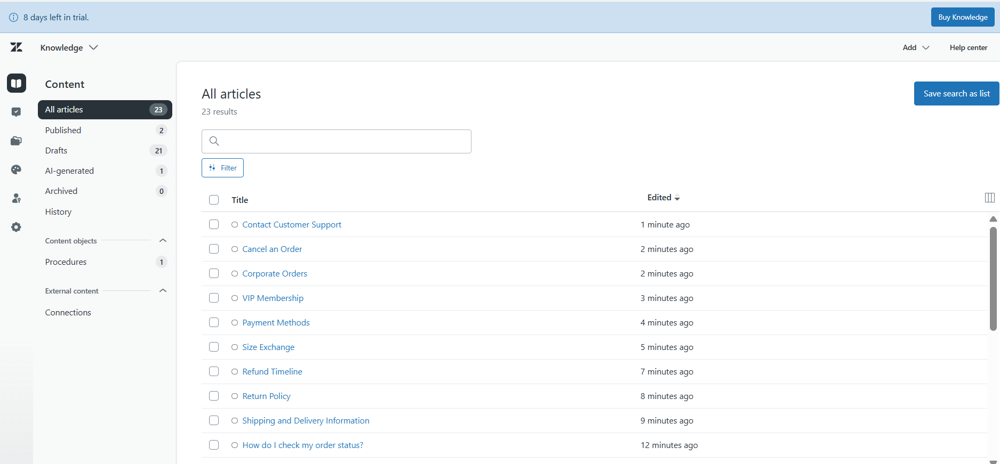

### Help Center

Developed customer-facing knowledge articles covering common support questions.

</td>

<td width="50%">

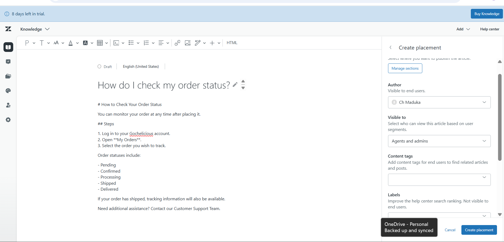

### Article Management

Created structured articles covering:

- Order Status
- Shipping
- Refunds
- Returns
- Payments
- Corporate Orders
- VIP Membership
- Customer Support

</td>

</tr>
</table>

---

## Agent Productivity

<table>
<tr>

<td width="50%">

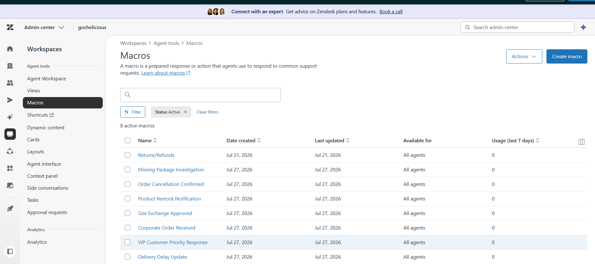

### Macros

Created reusable macros for common customer interactions, improving response consistency and reducing handling time.

</td>

<td width="50%">


### Agent Workspace

Configured the Zendesk Agent Workspace to provide an organized environment for ticket management and agent productivity.

</td>

</tr>
</table>

---

## Reporting & Analytics

<table>
<tr>

<td width="50%">

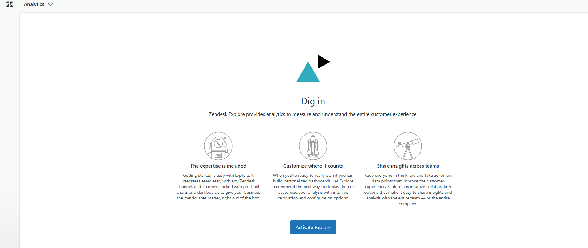

### Zendesk Explore

Enabled Zendesk Explore analytics to support operational reporting and customer service performance monitoring.

</td>

<td width="50%">

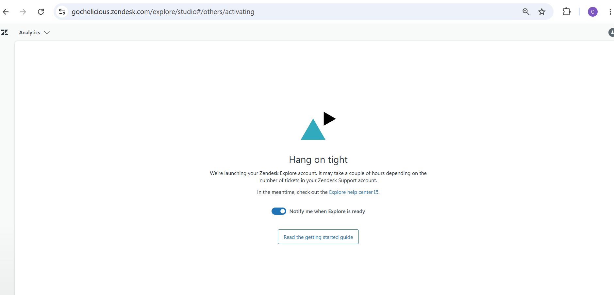

### Analytics Provisioning

Analytics provisioning was initiated during implementation. Dashboard generation was pending completion while the Zendesk trial environment was still provisioning Explore services.

</td>

</tr>
</table>

---

# Repository Structure

```
zendesk-support-implementation/

├── README.md

├── screenshots/
│   ├── dashboard/
│   ├── forms/
│   ├── fields/
│   ├── users/
│   ├── organizations/
│   ├── triggers/
│   ├── automations/
│   ├── sla/
│   ├── schedules/
│   ├── help-center/
│   ├── reports/
│   └── macros/

├── documentation/
│   ├── Zendesk Setup Guide.pdf
│   ├── Ticket Workflow.pdf
│   └── Knowledge Base Guide.pdf

```

---

# Skills Demonstrated

- Zendesk Support Administration
- CRM Implementation
- Workflow Automation
- Ticket Lifecycle Management
- SLA Configuration
- Customer Service Operations
- Business Process Design
- Knowledge Management
- Help Center Administration
- Macros
- Ticket Forms
- Custom Fields
- Support Group Management
- Reporting & Analytics
- Customer Experience Optimization

---

# Project Outcomes

✔ Complete Zendesk Support implementation

✔ Structured customer ticket workflows

✔ Automated routing and ticket management

✔ SLA-driven customer support

✔ Centralized knowledge base

✔ Improved agent productivity

✔ Scalable support operations

---

This project demonstrates my ability to design and implement scalable customer support operations using Zendesk, including workflow automation, ticket lifecycle management, SLA configuration, knowledge management, and customer experience optimization.

# Author

## Chika Blessing

**Executive Business Partner | Success Partner | Healthcare Operations Specialist | CRM & Workflow Automation | Project Manager | Executive Virtual Assistant | Customer Success**

---
"Same warmth, wherever you find me."
⭐ If you found this project interesting, feel free to explore the repository or connect with me on www.linkedin.com/in/blessing-c-success-partner.
